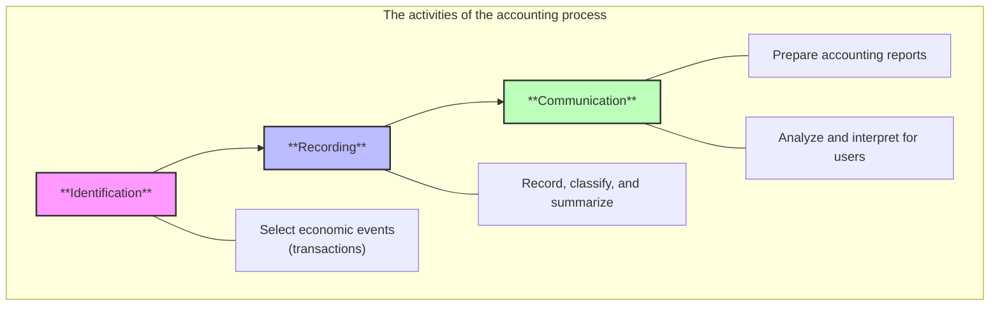
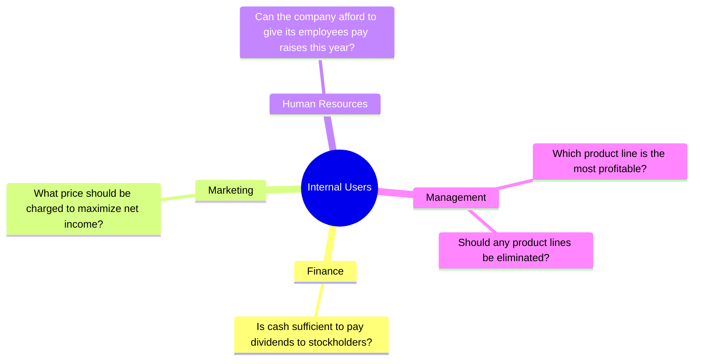
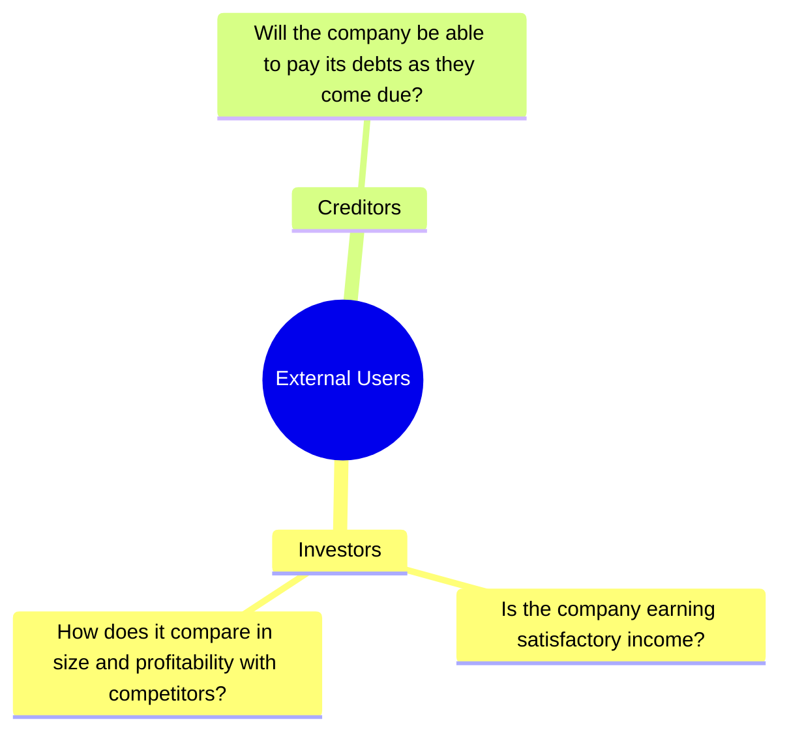

#economics #accounting #principles 

There are two broad groups of users of financial information:
1. **Internal users**: Managers who plan, organize, and run the business. They must answer many important questions:

2. **External users**: Individuals and organizations outside a company who want financial information about the company. Two most common types are:
	- **Investors** (Owners) use accounting information to decide whether to buy, hold, or sell ownership shares of a company.
	- **Creditors** (Suppliers and Bankers) use accounting information to evaluate the risks of granting credit or lending money.

=> **Financial accounting** answers these questions.

---
# Accounting Equation
$$
\text{Assets} = \text{Liabilities} + \text{Owner’s Equity} = \text{Liabilities} + (\text{Owner’s Capital} - \text{Owner’s Drawings} + \text{Revenues} - \text{Expenses})
$$

- **Assets** are resources a business owns
- **Liabilities** are claims against assets—that is, existing debts and obligations.
- The ownership claim on total assets is **owner’s equity**.
	- **Owner’s capital**: Investments by owner are the assets the owner puts into the business.
	- **Revenues** are the gross increase in owner’s equity resulting from business activities entered into for the purpose of earning income. 
	- **Owner's drawing**: An owner may withdraw cash or other assets for personal use.
	- **Expenses** are the cost of assets consumed or services used in the process of earning revenue.
