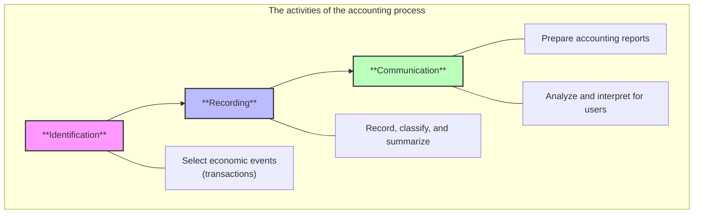
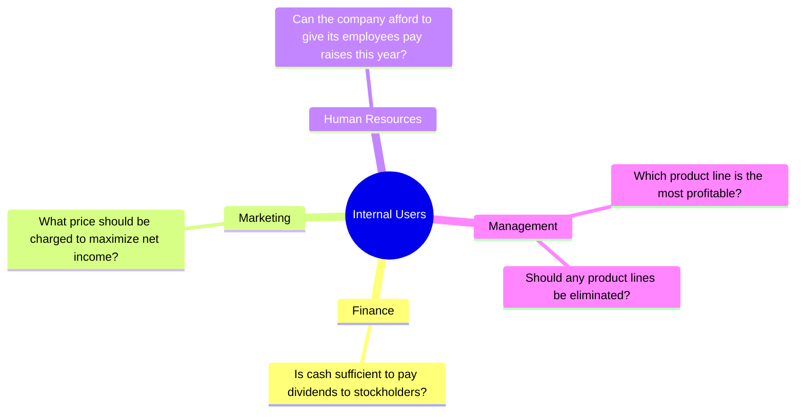
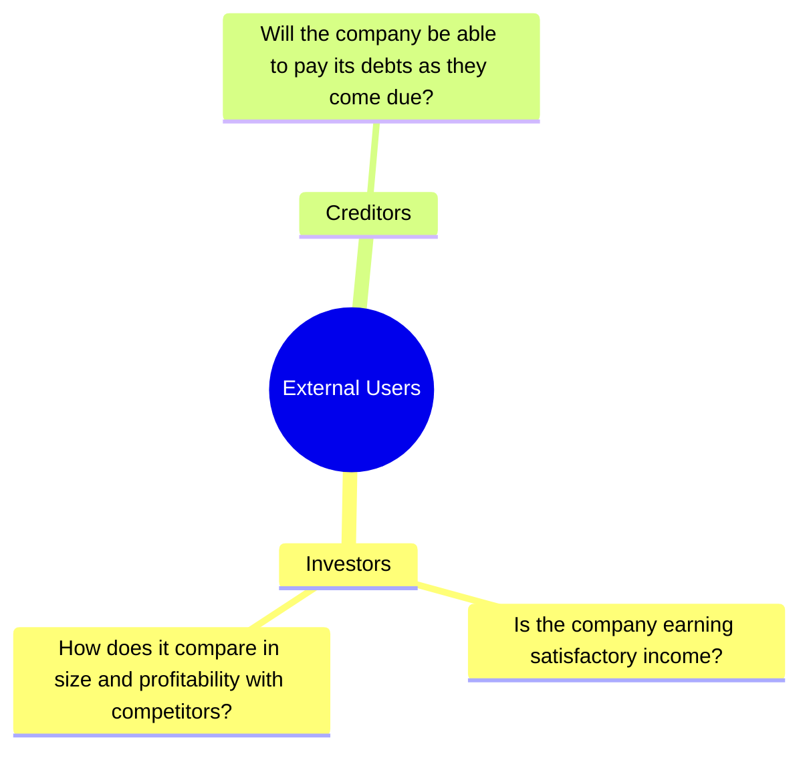
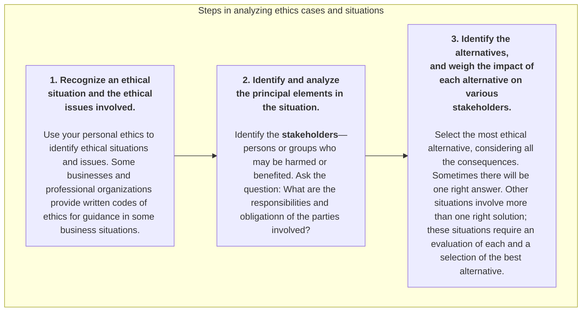
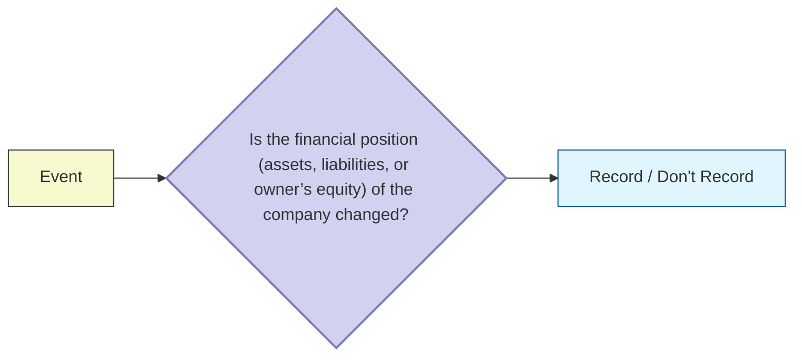

#economics #accounting #principles 

There are two broad groups of users of financial information:
1. **Internal users**: Managers who plan, organize, and run the business. They must answer many important questions:

2. **External users**: Individuals and organizations outside a company who want financial information about the company. Two most common types are:
	- **Investors** (Owners) use accounting information to decide whether to buy, hold, or sell ownership shares of a company.
	- **Creditors** (Suppliers and Bankers) use accounting information to evaluate the risks of granting credit or lending money.

=> **Financial accounting** answers these questions.

# The Building Blocks of Accounting
> An accountant follows certain standards in reporting financial information, which based on _principles_ and _assumptions_. For these standards to work, however, a fundamental business concept must be present—_ethical behavior_.

The standards of conduct by which actions are judged as right or wrong, honest or dishonest, fair or not fair, are **ethics**. Effective financial reporting depends on sound ethical behavior.

## Generally Accepted Accounting Principles (GAAP)
GAAP generally uses one of two measurement principles:
- **Historical cost principle** dictates that companies record  assets at their cost. This is true not only at the time the asset is purchased, but also over the time the asset is held.
- **Fair value principle** states that assets and liabilities should be reported at fair value (the price received to sell an asset or settle a liability).

> [!NOTE]
> Selection of which principle to follow generally relates to trade-offs between _relevance_ (financial information is capable of making a difference in a decision) and _faithful representation_ (the numbers and descriptions match what really existed or happened

Assumptions provide a foundation for the accounting process. Two main assumptions are:
- The **monetary unit assumption** requires that companies include in the accounting records only transaction data that can be expressed in money terms.
- The **economic entity assumption** requires that the activities of the entity be kept separate and distinct from the activities of its owner and all other  economic entities.

| Feature / Criteria            | Proprietorship                                                             | Partnership                                                                                  | Corporation                                                                           |
|:----------------------------- |:-------------------------------------------------------------------------- |:-------------------------------------------------------------------------------------------- |:------------------------------------------------------------------------------------- |
| **Ownership**                 | 1 person.                                                                  | 2 or more persons.                                                                           | Divided into transferable shares of stock (Stockholders).                             |
| **Liability**                 | Unlimited (personally liable for all debts).                               | Unlimited (each partner generally has unlimited personal liability).                         | Limited (stockholders are not personally liable for corporate debts).                 |
| **Legal Status & Accounting** | No legal distinction from the owner. Accounting records are kept separate. | Accounting records are kept separate. Governed by a partnership agreement (written or oral). | Separate legal entity under state law. Enjoys an unlimited life.                      |
| **Capital & Transferability** | Relatively small amount of capital needed to start.                        | Initial investment and withdrawal settlement set by agreement.                               | Shares of stock can be easily transferred (sold) at any time.                         |
| **Management & Profits**      | Owner is often the manager. Receives all profits, suffers all losses.      | Duties and division of net income/loss are set by the agreement.                             | Far fewer in number, but produce 8 times greater revenue than the other two combined. |

---
# Accounting Equation
$$
\text{Assets} = \text{Liabilities} + \text{Owner’s Equity} = \text{Liabilities} + \text{Owner’s Capital} - \text{Owner’s Drawings} + \text{Revenues} - \text{Expenses}
$$

- **Assets** are resources a business owns
- **Liabilities** are claims against assets—that is, existing debts and obligations.
- The ownership claim on total assets is **owner’s equity**.
	- **Owner’s capital**: Investments by owner are the assets the owner puts into the business.
	- **Revenues** are the gross increase in owner’s equity resulting from business activities entered into for the purpose of earning income. 
	- **Owner's drawing**: An owner may withdraw cash or other assets for personal use.
	- **Expenses** are the cost of assets consumed or services used in the process of earning revenue.

## Effects of business transactions
> **Transactions** (business transactions) are a business’s economic events recorded by accountants. Transactions may be _external_ or _internal_. (**External transactions** involve economic events between the company and some outside enterprise. **Internal transactions** are economic events that occur entirely within one company.)

---
# Four Financial Statements
1. An **income statement** presents the revenues and expenses and resulting net income or net loss for a specific period of time.
2. An **owner’s equity statement** summarizes the changes in owner’s equity for a specific period of time.
3. A **balance sheet** reports the assets, liabilities, and owner’s equity at a specific date.
4. A **statement of cash flows** summarizes information about the cash inflows (receipts) and outflows (payments) for a specific period of time.
