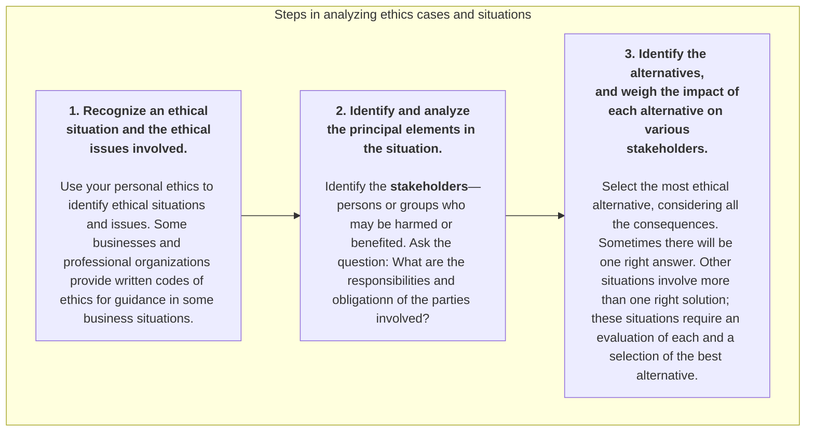

#economics #accounting 
> An accountant follows certain standards in reporting financial information, which based on _principles_ and _assumptions_. For these standards to work, however, a fundamental business concept must be present—_ethical behavior_.

The standards of conduct by which actions are judged as right or wrong, honest or dishonest, fair or not fair, are **ethics**. Effective financial reporting depends on sound ethical behavior.

