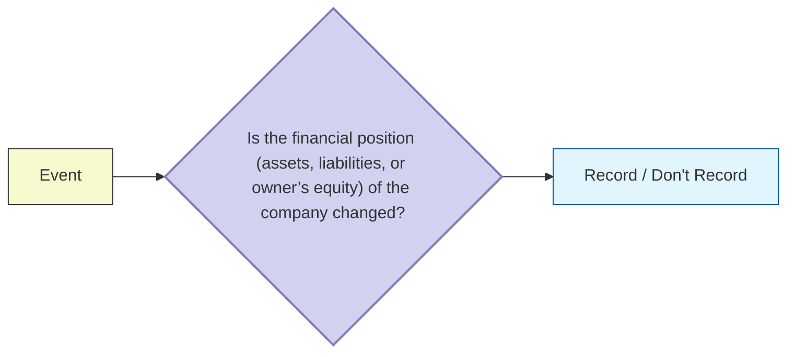

#economics #accounting 
> **Transactions** (business transactions) are a business’s economic events recorded by accountants. Transactions may be _external_ or _internal_. (**External transactions** involve economic events between the company and some outside enterprise. **Internal transactions** are economic events that occur entirely within one company.)

