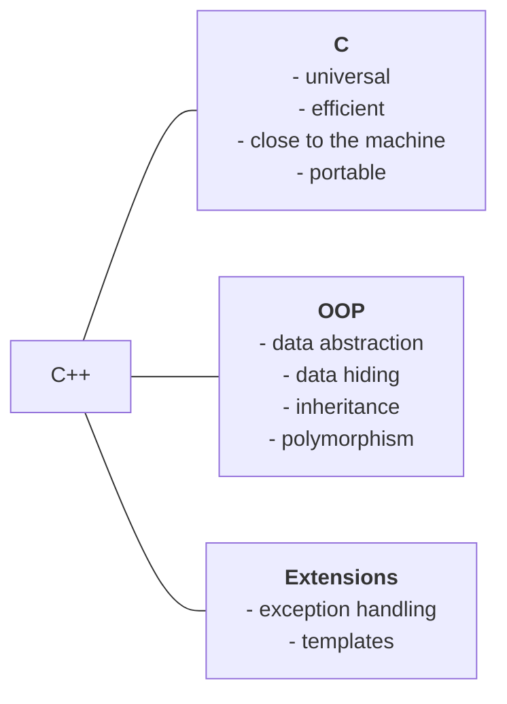
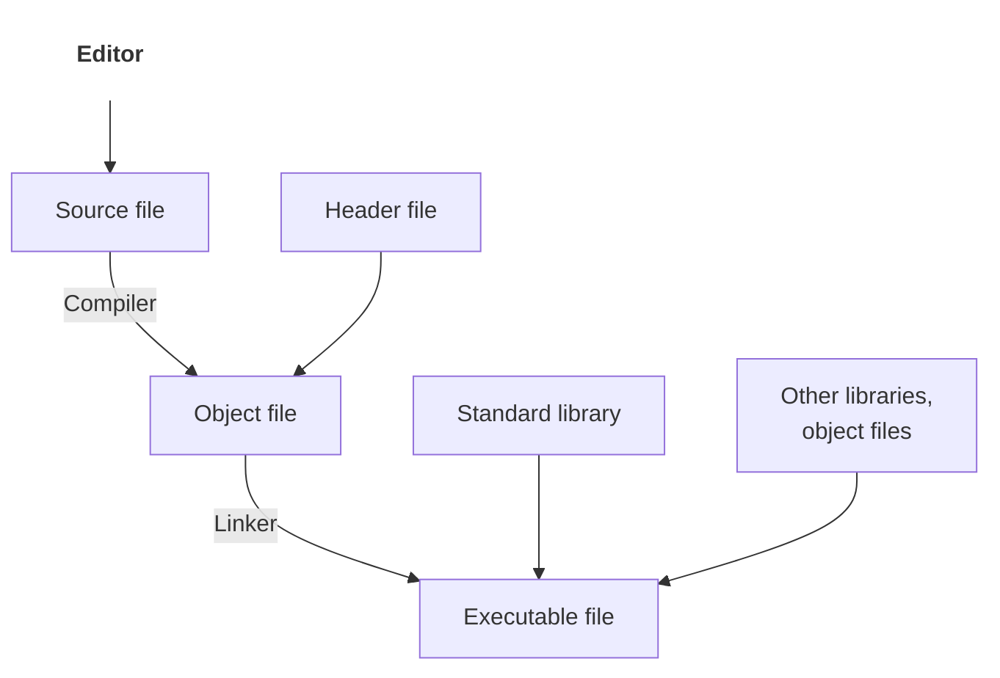

#Cpp #Fundamentals

```mermaid
graph LR
    Root[C++] --- Node1["<b>C</b><br>- universal<br>- efficient<br>- close to the machine<br>- portable"]
    Root --- Node2["<b>OOP</b><br>- data abstraction<br>- data hiding<br>- inheritance<br>- polymorphism"]
    Root --- Node3["<b>Extensions</b><br>- exception handling<br>- templates"]
```

# Developing a C++ Program

```mermaid
graph TD
    %% Định nghĩa các điểm bắt đầu và label
    Editor((Editor)) --> src["Source file"]
    
    %% Các tệp phụ trợ
    hdr["Header file"]
    std["Standard library"]
    oth["Other libraries,<br>object files"]
    
    %% Quá trình xử lý
    src -- "Compiler" --> obj["Object file"]
    hdr --> obj
    
    obj -- "Linker" --> exe["Executable file"]
    std --> exe
    oth --> exe
    
    %% Tùy chỉnh hiển thị chữ "Editor" thành dạng text thuần (giống trong hình)
    style Editor fill:none, stroke:none, font-weight:bold
```

# Sample Program
```c
#include <iostream>
using namespace std;

/* Hello World */
int main()
{
	cout << "Hello Wrold!" << endl;
	return 0;
}
```