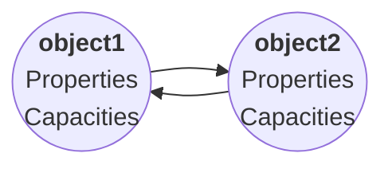

#OOP #Cpp 

```mermaid
graph LR
    o1(("<b>object1</b><br>Properties<br>Capacities"))
    o2(("<b>object2</b><br>Properties<br>Capacities"))
    
    o1 --> o2
    o2 --> o1
```

Advantages of OOP:
- reduced susceptibility to errors
- easy to re-use
- low maintenance requirement