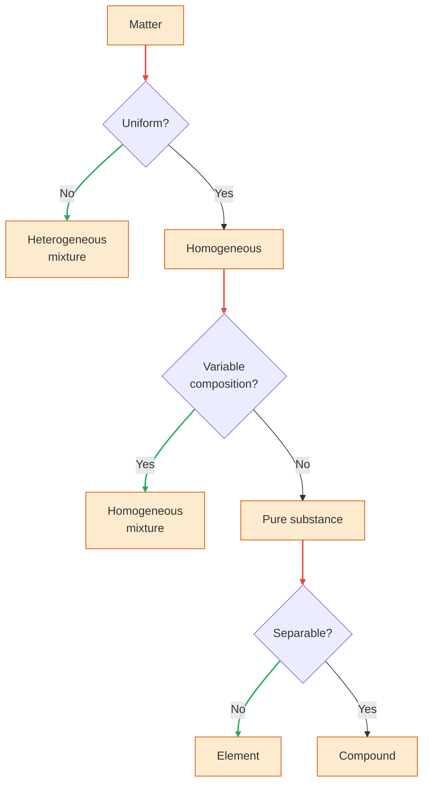

> Chemistry is the study of the properties and behavior of matter.
# What is Matter?
- **Matter** is the physical material of the universe; it is anything that has mass and occupies space.
- A **property** is any characteristic that allows us to recognize a particular type of matter and to distinguish it from other types.
- In **[[Atoms, Molecules, Ions#Molecules and Molecular Compounds|molecules]]**, two or more **[[Atoms, Molecules, Ions#Atoms|atoms]]** are joined together in specific shapes.

# Classification of Matter
**States of matter**: Gas - Liquid - Solid

1. **Pure Substance** is matter that has distinct properties and a composition that does not vary from sample to sample.
2. **Elements** are substances that cannot be decomposed into simpler substances.
3. **Compounds** are substances composed of two or more elements; they contain two or more kinds of [[Atoms, Molecules, Ions#Atoms|atoms]]
4. **Mixtures** are combinations of two or more substances in which each substance retains its chemical identity.
5. **Heterogeneous** are mixtures do not have the same composition, properties, and appearance throughout.
6. **Homogeneous** are mixtures that are uniform throughout.

# Properties of Matter
**Physical properties** can be observed without changing the identity and composition of the substance. (color, odor, density, melting point, boiling point and hardness)
**Chemical properties** describe the way a substance may change, or react, to form other substances.
**Intensive properties** do not depend on the amount of sample being examined >< **Extensive properties**