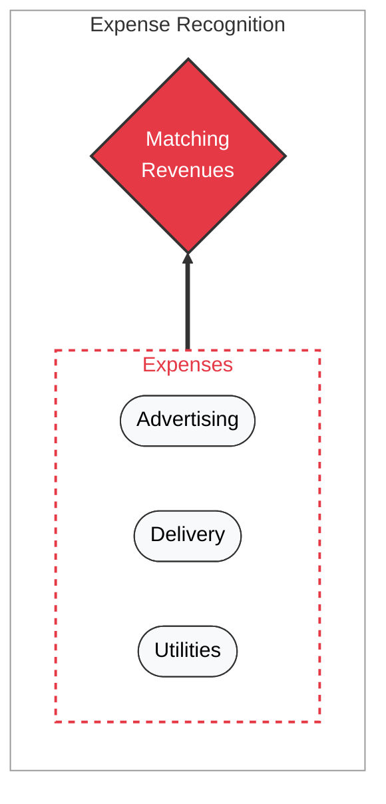

#economics #accounting 

```mermaid
flowchart BT
    subgraph ER ["Expense Recognition"]
        direction BT
        
        subgraph Expenses ["Expenses"]
            direction LR
            E1([Advertising])
            E2([Delivery])
            E3([Utilities])
        end
        
        MR{"Matching<br>Revenues"}
        
        %% Mũi tên đậm thể hiện sự liên kết/đối ứng
        Expenses ==> MR
    end

    %% Tùy chỉnh màu sắc (Tone đỏ/hồng đồng bộ với ảnh gốc)
    style MR fill:#e63946,color:#fff,stroke:#333,stroke-width:2px
    style Expenses fill:transparent,stroke:#e63946,stroke-width:2px,color:#e63946,stroke-dasharray: 5 5
    style ER fill:transparent,stroke:#999,stroke-width:1px
    
    %% Định dạng các node chi tiết
    classDef item fill:#f8f9fa,stroke:#333,stroke-width:1px,color:#000
    class E1,E2,E3 item
```

Expense recognition is tied to [[Revenue Recognition]]