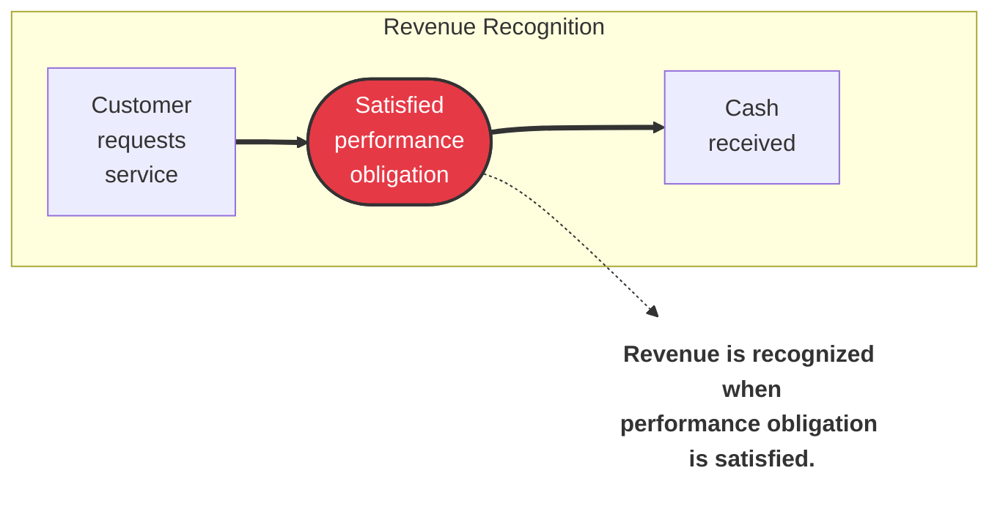

#accounting #economics 

1. When a company agrees to perform a service or sell a product to a customer, it has a performance obligation. 
2. When the company meets this performance obligation, it recognizes revenue. 
3. The revenue recognition principle there fore requires that companies recognize revenue in the accounting period in which the performance obligation is satisfied.

