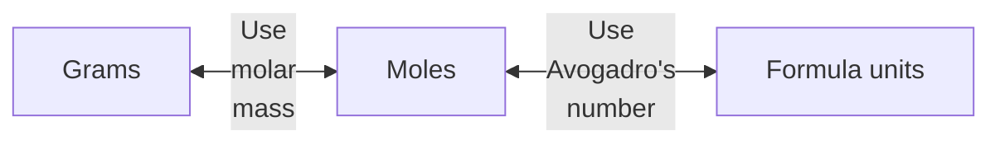
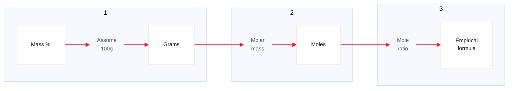

One **mole** is the amount of [[matter]] that contains as many objects ([[atoms]], [[molecules]],...) as the number of [[atoms]] in exactly 12 g of isotopically pure $^{12}C$ (**Avogadro's number** ($N_A$) = $6.02 \times 10^{23}$)

The mass in grams of one mole of a substance (that is the mass in grams per mole) is called the **molar mass** of the substance.

=> Interconverting Mass & Moles / Mass & Number of Particles

=> Calculating an Empirical Formula: 

=> The subscripts in the molecular formula of a substance are always whole-number multiples of the subscripts in its empirical formula.
$$\text{Whole-number multiple} =  \frac{\text{molecular weight}}{\text{empiprical formula weight}}$$