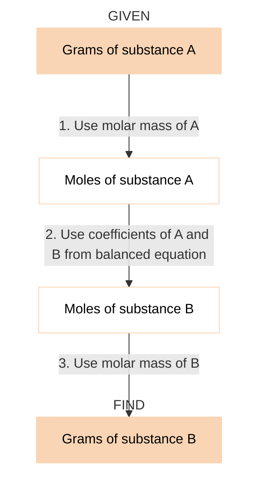

#chemistry #principles #equation 
> **Stoichiometry** is the area of study that examines the quantities of substances consumed and produced in chemical reactions.

# Chemical Equations
$$aA + bB \to cC + dD$$
- $a, b, c, d$: coefficients
- $A, B$: reactants
- $C, D$: products
- $(g), (s), (aq)$: physical state

## Some Simple Patterns of Chemical Reactivity
- **Combination Reactions**: Two or more reactants combine to form a single product.
- **Decomposition Reactions**: A single reactant breaks apart to form two or more substances.
- **Combustion Reactions**: Rapid reactions that produce a flame.

## Quantitative Information from Balanced Equations
The coefficients in a balanced chemical equation indicate both the relative numbers of [[molecules]] (or formula units) in the reaction and the relative numbers of moles.
The quantities $a$ mol $A$, $b$ mol $B$, $c$ mol $C$, $d$ mol $D$ given by the coefficients are called **stoichiometrically equivalent quantities**. The relationship between these quantities can be represented as $$a \text{ mol A} \simeq b \text{ mol B} \simeq c \text{ mol C} \simeq d \text{ mol D}$$

## [[Limit]] Reactant
The reactant that is completely consumed in a reaction is called the **limiting reactant** because it determines, or limits, the amount of product formed. The other reactants are sometimes called **excess reactants**.

## Theoretical Yields
$$
\text{Percent yield } = \frac{\text{actual yield}}{\text{theoretical yield}} \times 100 \%
$$
