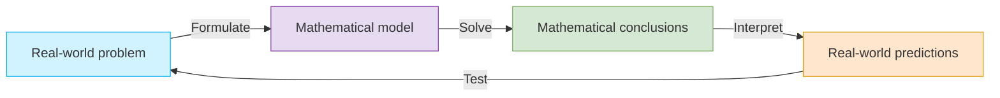

# Function
> A function is a rule that assigns to each element _x_ in a set _D_ exactly one element, called _f(x)_ , in a set _E_.

	
	

		<li><i>D</i>: <mark>domain</mark></li>
		<li><mark>range</mark> of <i>f</i>: all possible values of <i>f(x)</i> as <i>x</i> varies throughout the domain</li>
		<li><mark>independent variable</mark>: A symbol that represents an arbitrary number in the domainof a function <i>f</i></li>
		<li><mark>dependent variable</mark>: A symbol that represents a number in the range of <i>f</i>
		
=> <b>The Vertical Line Test</b>: A curve in the <i>xy</i>-plane is the graph of a function of <i>x</x> if and only if no vertical line intersects the curve more than once

	

**Piecewise defined functions** are defined by different formulas in different parts of their domains: $f(x) = \begin{cases} h(x) & \text{if } x \le a \\ g(x) & \text{if } x > a \end{cases}$

**Symmetry**
- ==Even function==: _f(x)_ = _f(-x)_
- ==Odd function==: _f(-x)_ = -_f(x)_

**Increasing and Decreasing Functions**: A function is called
- ==Increasing== on an interval _I_ if: $f(x_1) < f(x_2) \text{ whenever } x_1 < x_2 \text{ in } I$
- ==Decreasing== on _I_ if: $f(x_1) > f(x_2) \text{ whenever } x_1 < x_2 \text{ in } I$

## Mathematical Models
> A **mathematical model** is a mathematical description (often by means of a function or an equation) of a real-world phenomenon

1. **Linear Models**: _y_ = _f(x)_ = _mx_ +  _b_ (_m_ is the slope of the line and _b_ is the y-intercept.)
2. **Polynomials**: $P(x) = a_n x^n + a_{n-1} x^{n-1} + \dots + a_2 x^2 + a_1 x + a_0$ (_n_ is a nonnegative integer and the numbers  _a0,..., an_ are constants called the coefficients of the polynomial)

=> Degree1: ==Linear function==; Degree2: ==Quadratic function==; Degree3: ==Cubic function==

3. **Power Functions**: _f(x)_ = _xa_

=> _a_ = 1 / _n_: ==Root function==; _a_ = -1: ==Reciprocal function==

4. **Rational Functions**: $f(x) = \frac{P(x)}{Q(x)}$
5. **Algebraic Functions** can be constructed using algebraic operations (such as addition, subtraction, multiplication, division, and taking roots)
6. **Trigonometric Functions**: _sin(x)_, _cos(x)_,...
7. **Exponential functions**:  _f(x)_ = _ax_
8. **Logarithmic Functions**: _f(x)_ = _logax_

## Creating New Functions form Old Functions
==Transformation of Functions==
1. Vertical and Horizontal Shifts: Suppose c > 0. To obtain the graph of
- _y_ = _f(x)_ + c, shift the graph of _y_ = _f(x)_ a distance c units upward
- _y_ = _f(x)_ - c, shift the graph of _y_ = _f(x)_ a distance c units downward
- _y_ = _f(x - c)_, shift the graph of _y_ = _f(x)_ a distance c units to the right
- _y_ = _f(x + c)_, shift the graph of _y_ = _f(x)_ a distance c units to the left

2. Vertical and Horizontal Stretching and Reflecting: Suppose c > 1. To obtain the graph of:
- _y_ = _cf(x)_,  stretch the graph of _y_ = _f(x)_ vertically be a factor of c
- _y_ = _(1/c)f(x)_, shrink the graph of _y_ = _f(x)_ vertically be a factor of c
- _y_ = _f(cx)_,  stretch the graph of _y_ = _f(x)_ horizontally be a factor of c
- _y_ = _f(x/c)_,  shrink the graph of _y_ = _f(x)_ horizontally be a factor of c
- _y_ = -_f(x)_,  reflect the graph of _y_ = _f(x)_ about the x-axis
- _y_ = -_f(-x)_,  reflect the graph of _y_ = _f(x)_ about the y-axis

==Combinations of Functions==
- _(f + g)(x)_ = _f(x)_ + _g(x)_
- _(f - g)(x)_ = _f(x)_ - _g(x)_
- _(fg)(x)_ = _f(x)g(x)_
- _(f/g)(x)_ = _f(x)_ / _g(x)_
- **Composite function**: $(f \circ g)(x) = f(g(x))$

# Limit of A Function
Suppose _f(x)_ is defined when _x_ is near the number _a_. (This means that _f_ is defined on some open interval that contains _a_, except possibly at _a_ itself.) Then we write: $$\lim_{x \to a} f(x) = L$$ and say "the limit of _f(x)_, as _x_ approaches _a_, equals _L_"

1. if we can make the values of _f(x)_ arbitrarily close to _L_ (as close to _L_ as we like) by taking _x_ to be sufficiently close to _a_ (on either side of _a_) but note equal to _a_.

2. if for every number $\varepsilon > 0$ there is a number $\delta > 0$ such that
$$\text{if } 0 < |x - a| < \delta \quad \text{then} \quad |f(x) - L| < \varepsilon$$

**One-Sided Limits**: $\lim_{t \to 0^-} H(t) = \text{a} \quad \text{and} \quad \lim_{t \to 0^+} H(t) = \text{a}$ 

=> $\lim_{x \to a} f(x) = L$ if and only if $\lim_{t \to 0^-} H(t) = L$ and $\lim_{t \to 0^+} H(t) = L$ 

## Calculating Limits Using the Limit Laws
1. $\lim_{x \to a} [f(x) + g(x)] = \lim_{x \to a} f(x) + \lim_{x \to a} g(x)$
2. $\lim_{x \to a} [f(x) - g(x)] = \lim_{x \to a} f(x) - \lim_{x \to a} g(x)$
3. $\lim_{x \to a} [c f(x)] = c \lim_{x \to a} f(x)$
4. $\lim_{x \to a} [f(x) g(x)] = \lim_{x \to a} f(x) \cdot \lim_{x \to a} g(x)$
5. $\lim_{x \to a} \frac{f(x)}{g(x)} = \frac{\lim_{x \to a} f(x)}{\lim_{x \to a} g(x)} \text{ if } \lim_{x \to a} g(x) \neq 0$
6. $\lim_{x \to a} [f(x)]^n = [\lim_{x \to a} f(x)]^n$ where _n_ is a positive integer
7.  $\lim_{x \to a} c = c$
8.  $\lim_{x \to a} x = a$
9.  $\lim_{x \to a} x^n = a^n$
10. $\lim_{x \to a} \sqrt[n]{x} = \sqrt[n]{a}$
11. $\lim_{x \to a} \sqrt[n]{f(x)} = \sqrt[n]{\lim_{x \to a} f(x)}$ where n is a positive integer. (If n is even, we assume that $\lim_{x \to a} f(x) > 0$
12. If $f$ is a polynomial or a rational function and $a$ is in the domain of $f$, then $\lim_{x \to a} f(x) = f(a)$
13. If $f(x)$ = $g(x)$ when $x$ $\neq$ $a$, then  $\lim_{x \to a} = \lim_{x \to a} g(x)$, provided the limits exist
14. $$\text{If } f(x) \leqslant g(x) \text{ when } x \to a, \lim_{x \to a} f(x) \leqslant \lim_{x \to a} g(x)$$
15. $$\text{If } f(x) \leqslant g(x) \leqslant h(x) \text{ and } \lim_{x \to a} f(x) = \lim_{x \to a} h(x) = L$$
$$\lim_{x \to a} g(x) = L$$

## Continuity
> A function is continuous on an interval if it is continuous at every number in the interval. (If $f$ is defined only on one side of an endpoint of the interval, we understand continuous at the end point to mean continuous from the right or continuous from the left.

A function $f$ is **continuous** at a number $a$ if $\lim_{x \to a} f(x) = f(a)$. 
- From the right: $\lim_{x \to a^+} f(x) = f(a)$
- From the left: $\lim_{x \to a^-} f(x) = f(a)$

==Theorem==:
1. If $f$ and $g$ are continuous at $a$ and $c$ is constant, then the following functions are also continuous at $a$: $f + g$; $f - g$; $cf$; $fg$; $f / g$
2. Any polynomial is continuous everywhere; that is, it is continuous on $R$
3. Any rational function is continuous wherever it is defined; that is, it is continuous on its domain.
4. The following types of functions are continuous at every number in their domains: polynomials, rational functions; root functions; trigonometric funtions
5. If $f$ is continuous at $b$ and $\lim_{x \to a} g(x) = b$, then $\lim_{x \to a} f(g(x)) = f(b)$. In other words:
$$\lim_{x \to a} f(g(x)) = f\left(\lim_{x \to a} g(x)\right)$$
6. If $g$ is continuous at $a$ and $f$ is continuous at $g(a)$, then the composite function $f \circ g$ given by $(f \circ g)(x) = f(g(x))$ is continuous at $a$
7. **The Intermediate Value Theorem**: Suppose that $f$ is continuous on the closed interval [a,b] and let $N$ be any number between $f(a)$ and $f(b)$, where $f(a) \neq f(b)$. Then there exists a number $c$ in $(a,b)$ such that $f(c) = N$